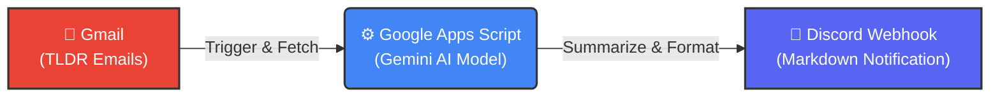

# 🤖 AI Tech News Aggregator & Discord Bot

這是一個全自動化的科技新聞彙整機器人。它能夠自動讀取 Gmail 中的 TLDR 電子報，利用 Google Gemini AI 進行分析與繁體中文摘要，並將整理好的懶人包自動推播至 Discord 頻道。

## 🏗️ 系統架構 (System Architecture)

## ✨ 核心功能 (Key Features)

* **自動化監控**：使用 Google Apps Script 定時掃描 Gmail 收件匣。
* **智慧分類**：自動識別信件類別（Web3, AI, DevOps, InfoSec 等 10+ 種分類）。
* **AI 摘要**：串接 **Google Gemini 2.5 Flash** 模型，將英文長文轉化為結構化的繁體中文摘要。
* **Rate Limit 保護**：內建冷卻機制與錯誤重試邏輯，防止 API 配額超限。
* **Discord 整合**：使用 Webhook 發送包含日期、顏色標籤的 Markdown 卡片。

## 🛠️ 技術堆疊 (Tech Stack)

* **Runtime**: Google Apps Script (Serverless JavaScript)
* **AI Model**: Google Gemini API (gemini-2.5-flash / gemini-1.5-flash)
* **Integration**: Gmail API, Discord Webhooks
* **Format**: Markdown, JSON

## 🚀 如何使用 (Setup)

1.  **取得 API Keys**：
    * 至 Google AI Studio 申請 Gemini API Key。
    * 在 Discord 頻道設定中建立 Webhook URL。
2.  **部署腳本**：
    * 建立一個新的 Google Apps Script 專案。
    * 將 `Code.gs` 的內容複製貼上。
    * 填入你的 API Key 與 Webhook URL。
3.  **設定觸發器**：
    * 設定 Time-driven trigger (建議每小時執行一次)。

## 📝 學習心得 (Learning Outcomes)

* 實作了 **Prompt Engineering** 來優化 AI 的輸出格式與編碼問題。
* 解決了 Google Apps Script 在處理 UTF-8 編碼時的亂碼挑戰。
* 設計了 API 呼叫的速率限制 (Rate Limiting) 機制以符合 Free Tier 配額。

---
*Developed by JHIH-KAI CHEN*
